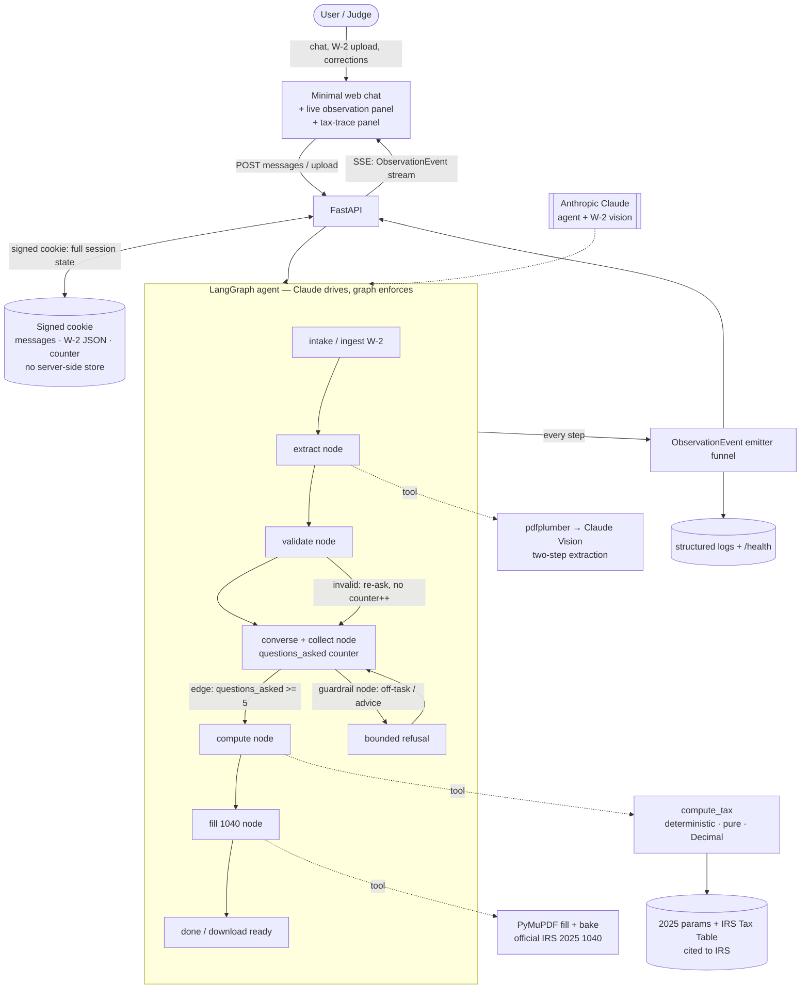

# Architecture — Agentic Tax-Filing Assistant

**Status:** agreed · **Last updated:** 2026-06-24 · **PRD:** [PRD.md](./PRD.md)
**Research:** [docs/research/](./research/) · **ADRs:** [docs/adrs/](./adrs/)

## Executive summary

A **LangGraph (Python)** agent powers a minimal web chat in which a person uploads a single ~$40k W-2, has a warm **≤5-question** conversation, and downloads a completed, correct **official IRS 2025 Form 1040**. The product is judged primarily as an **agentic harness**, so the central architectural bet is to build a *real* LLM-driven agent — Claude drives the conversation and tool use — whose four pillars are **enforced by the graph, not the prompt**: the question budget is a counter in graph state behind a conditional edge, guardrails and input-validation are graph nodes that run *outside the LLM's decision path*, and a single `ObservationEvent` schema streams every tool call, decision, and guardrail firing **live to the UI over SSE**.

The three most consequential decisions:

1. **LangGraph agent, pillars enforced in the graph** ([ADR-001](./adrs/ADR-001-langgraph-agent-harness.md), [ADR-002](./adrs/ADR-002-enforcement-in-graph-not-prompt.md)) — a genuine agent whose limits are concrete code a judge can point at, the strongest answer to the highest-weighted criterion (enforced vs. cosmetic).
2. **Tax math is deterministic, cited, unit-tested Python — never the LLM** ([ADR-006](./adrs/ADR-006-deterministic-tax-engine.md), [ADR-007](./adrs/ADR-007-tax-parameters-2025.md)) — frontier LLMs hit only ~23–32% strict accuracy on 1040s (TaxCalcBench), so correctness lives in code, using the **final 2025 figures** ($15,750/$31,500 standard deduction) and the **IRS Tax Table** (required under $100k). The sample filer's return is exactly **$3,227 tax / $4,405 refund / $0 credits**.
3. **Single `ObservationEvent` contract streamed live over SSE** ([ADR-004](./adrs/ADR-004-observation-event-contract.md), [ADR-009](./adrs/ADR-009-web-transport-sse-cookie-state.md)) — the observability pillar, surfaced as a live panel, backed by real framework events.

**Committed stretch features:** mid-conversation answer correction ([ADR-012](./adrs/ADR-012-stretch-mid-conversation-correction.md)) and a "show your work" tax-trace panel ([ADR-013](./adrs/ADR-013-stretch-tax-trace-panel.md)).

**Key risks:** the 2025 tax figures must be confirmed against published IRS instructions before freezing (OBBBA-derived; [ADR-007](./adrs/ADR-007-tax-parameters-2025.md)); IRS 1040 AcroForm field names must be enumerated against the live form ([ADR-005](./adrs/ADR-005-pdf-filling-pymupdf-bake.md)); Render free-tier spin-down is mitigated by a keep-alive ping ([ADR-011](./adrs/ADR-011-operability-hosting-render.md)).

## System overview

### Component diagram



**Walkthrough:** The user interacts through a minimal page with three regions — chat, a live observation panel, and a tax-trace panel. Messages and the uploaded W-2 POST to FastAPI; the agent's events stream back over **SSE**. The entire session (messages, extracted W-2 JSON, the question counter) rides in a **signed cookie** — no server-side store, so Render spin-down can't corrupt it and no PII is persisted. Inside the **LangGraph** agent, Claude drives the conversation, but the graph carries enforcement: the *extract → validate* path schema-checks every value before use; the *collect* node holds `questions_asked` and a **conditional edge** routes to *compute* once it hits 5 (the model can't reach a 6th question); a *guardrail* node intercepts off-task/advice requests with a bounded refusal; invalid input re-asks **without** spending a question. Real tools do the work: two-step W-2 extraction, the deterministic `compute_tax` (reading cited 2025 parameters + the IRS Tax Table), and PyMuPDF filling+baking the official 1040. Every transition, tool call, decision, and guardrail firing funnels through one `ObservationEvent` emitter into the live UI, the logs, and the trace panel.

### Data-flow: a full filing session

```mermaid
sequenceDiagram
    participant U as User/Judge
    participant UI as Web UI
    participant API as FastAPI
    participant G as LangGraph (Claude)
    participant T as Tools (extract/compute/fill)
    U->>UI: upload W-2 (or pick sample)
    UI->>API: POST upload  (+ signed-cookie session)
    API->>G: invoke graph
    G->>T: extract_w2 (pdfplumber → Vision)
    T-->>G: {wages, withholding, box12...} + confidence
    G->>API: SSE ObservationEvent: extracted values
    API-->>UI: render in observation panel
    G->>G: validate node (schema + cross-field checks)
    loop up to 5 questions
        G->>API: SSE: warm question (filing status / dependents / confirm)
        API-->>UI: show question
        U->>UI: answer
        UI->>API: POST answer (+cookie); counter++ in code
        API->>G: resume; (edge blocks Q#6)
    end
    G->>T: compute_tax(w2, answers)  [deterministic]
    T-->>G: TaxResult + line-by-line trace
    G->>API: SSE: trace steps ("tax $3,227 from Tax Table", "Saver's $0 because…")
    API-->>UI: render trace panel
    G->>T: fill_1040 (PyMuPDF + bake)
    T-->>G: completed official 1040 PDF
    G->>API: SSE: download ready
    API-->>UI: download link
    U->>UI: download completed 2025 Form 1040
```

## Decision index

| ADR | Decision | Status | Stretch | Contract |
|-----|----------|--------|---------|----------|
| [ADR-001](./adrs/ADR-001-langgraph-agent-harness.md) | LangGraph (Python) agent; LLM drives, graph enforces the pillars | Accepted | no | yes |
| [ADR-002](./adrs/ADR-002-enforcement-in-graph-not-prompt.md) | Question budget + guardrails enforced in graph (state/edges/nodes), not prompt | Accepted | no | no |
| [ADR-003](./adrs/ADR-003-anthropic-claude-agent-and-vision.md) | Anthropic Claude as agent + W-2 vision model | Accepted | no | no |
| [ADR-004](./adrs/ADR-004-observation-event-contract.md) | Single `ObservationEvent` schema is the observability contract | Accepted | no | yes |
| [ADR-005](./adrs/ADR-005-pdf-filling-pymupdf-bake.md) | Fill official IRS 1040 with PyMuPDF, bake() to flat static text | Accepted | no | yes |
| [ADR-006](./adrs/ADR-006-deterministic-tax-engine.md) | Tax computation is deterministic, pure, unit-tested code — never the LLM | Accepted | no | yes |
| [ADR-007](./adrs/ADR-007-tax-parameters-2025.md) | Cited final 2025 tax parameters as versioned data, incl. IRS Tax Table | Accepted | no | yes |
| [ADR-008](./adrs/ADR-008-w2-extraction-two-step.md) | Two-step W-2 extraction: pdfplumber then Claude Vision, with confidence | Accepted | no | no |
| [ADR-009](./adrs/ADR-009-web-transport-sse-cookie-state.md) | FastAPI + SSE transport, minimal chat, signed-cookie session state | Accepted | no | no |
| [ADR-010](./adrs/ADR-010-security-trust-boundaries.md) | Security: out-of-path enforcement, validated inputs, no PII at rest, secret hygiene | Accepted | no | no |
| [ADR-011](./adrs/ADR-011-operability-hosting-render.md) | Operability: single-instance Render, deferred scale, Docker one-command run | Accepted | no | no |
| [ADR-012](./adrs/ADR-012-stretch-mid-conversation-correction.md) | Stretch: mid-conversation answer correction via re-runnable state | Accepted | yes | no |
| [ADR-013](./adrs/ADR-013-stretch-tax-trace-panel.md) | Stretch: "show your work" tax-trace panel | Accepted | yes | no |

### Shared contracts (the roadmap freezes these)

Five contract-bearing ADRs (`Contract: yes`) define shapes multiple features share:

- **Agent graph state** ([ADR-001](./adrs/ADR-001-langgraph-agent-harness.md)) — `app/agent/state.py`: the `TypedDict` every node reads/writes; edges branch on `questions_asked`/`phase`.
- **ObservationEvent** ([ADR-004](./adrs/ADR-004-observation-event-contract.md)) — `app/observability/events.py`: the one event shape the UI, logs, and SSE stream all consume.
- **TaxResult** ([ADR-006](./adrs/ADR-006-deterministic-tax-engine.md)) — `app/tax/types.py`: the computed-return shape the PDF filler, observation emitter, and tests consume.
- **2025 tax parameters** ([ADR-007](./adrs/ADR-007-tax-parameters-2025.md)) — `app/tax/params_2025.py`: the single home of every 2025 figure + the Tax Table.
- **1040 field map** ([ADR-005](./adrs/ADR-005-pdf-filling-pymupdf-bake.md)) — `app/pdf/field_map.py`: logical line → AcroForm field name.

## Stretch features

- **Mid-conversation answer correction** ([ADR-012](./adrs/ADR-012-stretch-mid-conversation-correction.md)). The user can change an earlier answer (e.g. switch to MFJ, add a child) and the agent re-runs the deterministic computation without re-asking or spending a question. *Impresses because* it shows genuine statefulness (a judged pillar) live, and exercises the credits-when-earned path (MFJ + child flips EITC from $0 to non-zero). Reflected into the PRD (v2).
- **"Show your work" tax-trace panel** ([ADR-013](./adrs/ADR-013-stretch-tax-trace-panel.md)). Renders the 1040 line-by-line with reasoning ("Saver's Credit $0 because AGI $44,629 > $39,500 cutoff"). *Impresses because* it makes correctness inspectable rather than asserted — exactly the legibility a harness-focused judge rewards — and reuses the deterministic engine + observation contract, so it is low-cost. Reflected into the PRD (v2).

## Non-goals

Mirrors PRD §4: no itemized deductions; no income beyond a single W-2; no state/local returns; no filing statuses beyond Single and MFJ; no real e-filing or real PII; no tax advice; no UI polish beyond legibility of chat + observation + trace panels. Horizontal scale and persistent storage are explicitly deferred ([ADR-011](./adrs/ADR-011-operability-hosting-render.md)). A dedicated prompt-injection classifier is deferred ([ADR-010](./adrs/ADR-010-security-trust-boundaries.md)) — enforcement is already out of the LLM's path and data is fake.

## Open questions

All resolved into ADRs. Three carry verification tasks into the build (not open *decisions*, but facts to confirm before freezing):

1. Confirm the 2025 standard deduction / brackets / credit thresholds against the published IRS 2025 Form 1040 instructions before hardcoding ([ADR-007](./adrs/ADR-007-tax-parameters-2025.md); OBBBA-derived, currently high-confidence from primary sources).
2. Enumerate the live IRS 1040 AcroForm field names before building the field map ([ADR-005](./adrs/ADR-005-pdf-filling-pymupdf-bake.md)).
3. Verify Render free-tier spin-down timing with a live deploy; confirm the keep-alive approach holds through a judging window ([ADR-011](./adrs/ADR-011-operability-hosting-render.md)).
